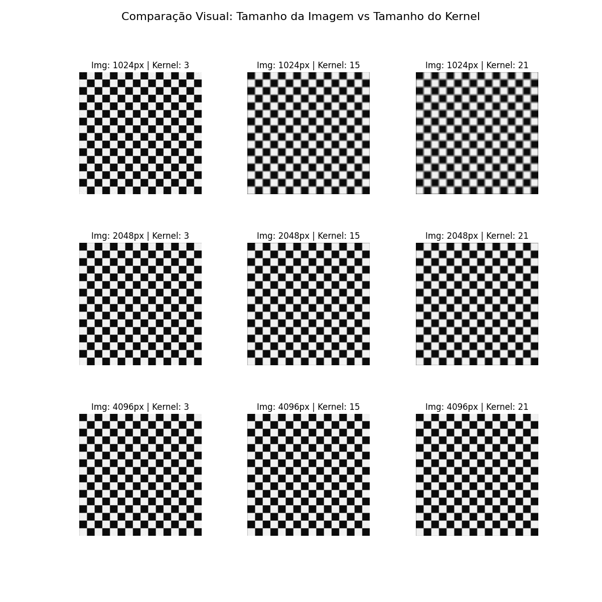
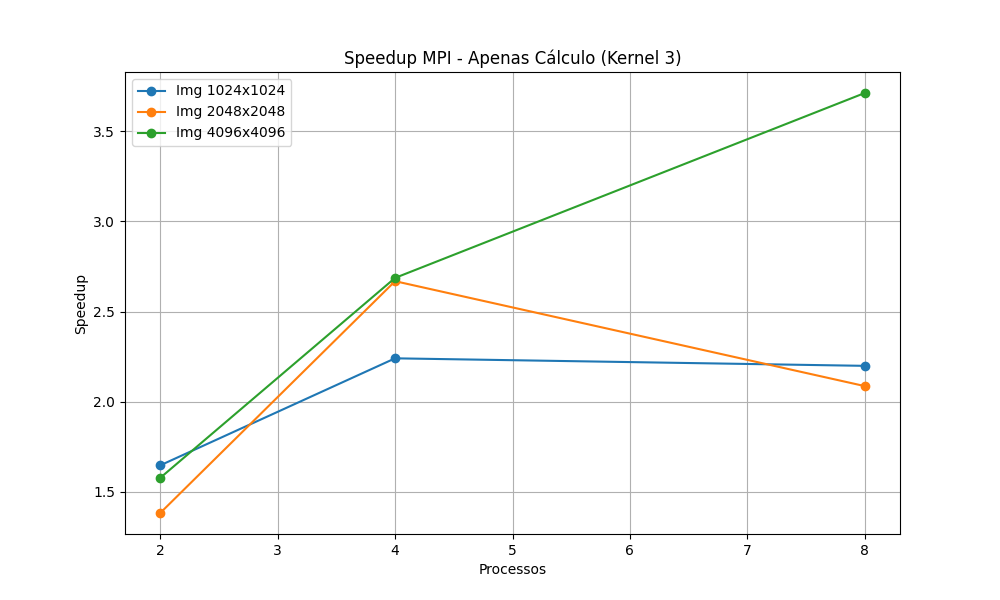
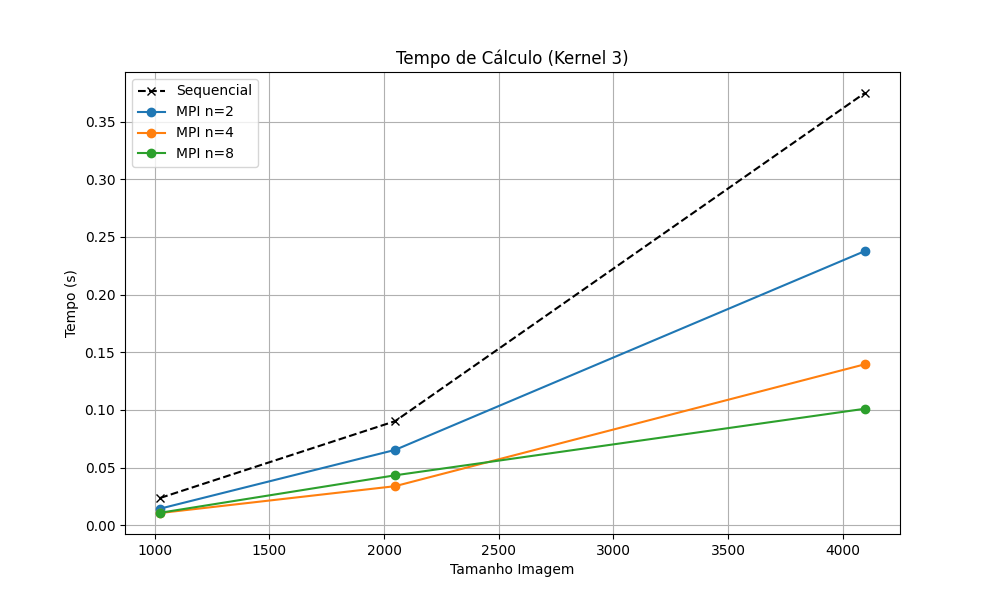
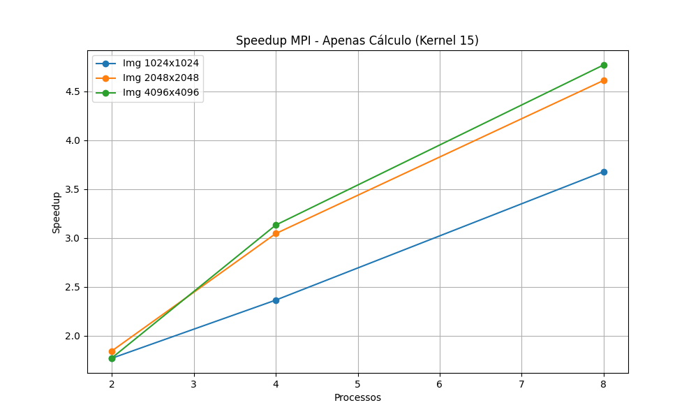
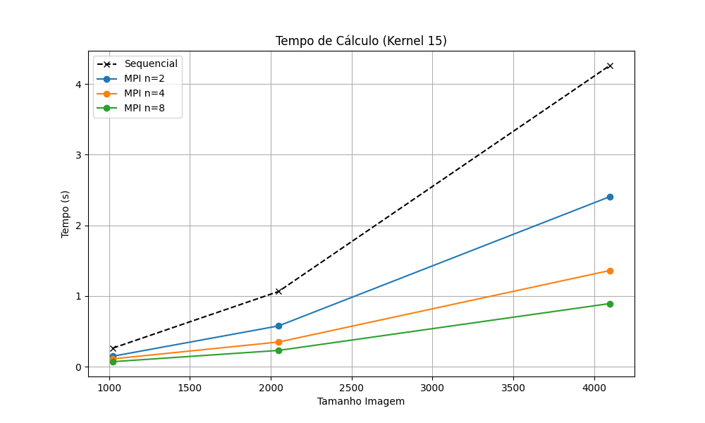
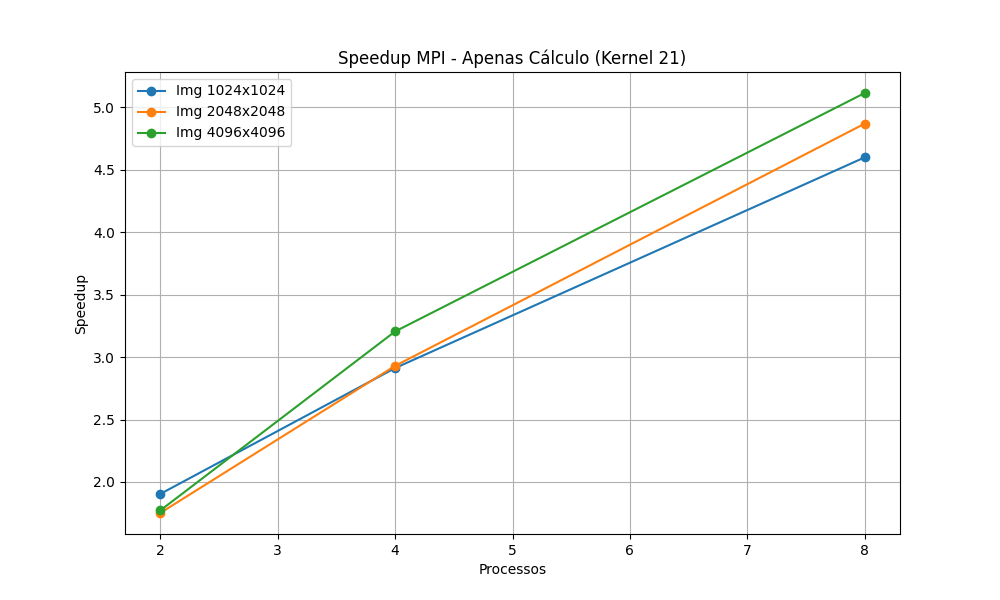
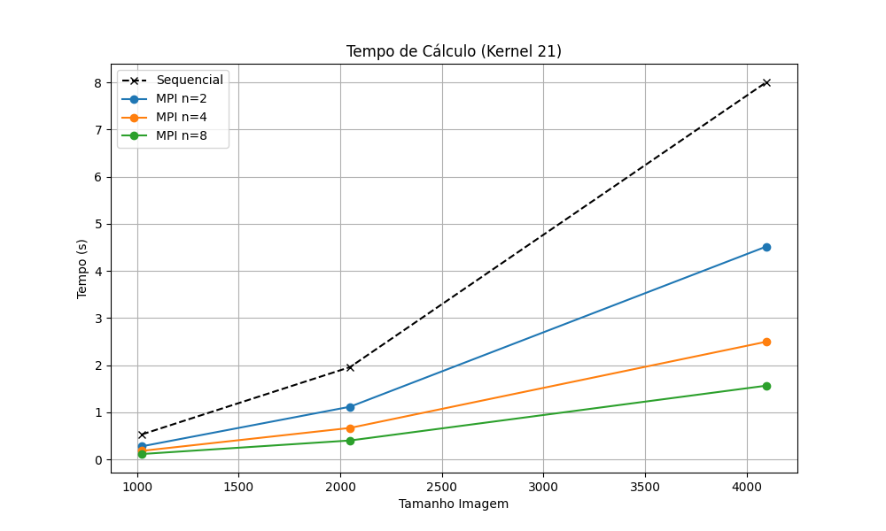

# Implementação Distribuída do Algoritmo Box Blur com MPI

**Autores:** 
- Fábio Bays de Araujo / 2370441
- Rafael Farias Meneses / 2263831

## 1. Introdução

Este projeto apresenta uma implementação paralela do filtro de processamento de imagens *Box Blur* (desfoque de caixa), desenvolvida em Python utilizando a biblioteca `mpi4py` para a interface de passagem de mensagens (MPI). O objetivo principal é analisar o comportamento do algoritmo em arquiteturas distribuídas, quantificando o ganho de desempenho (*speedup*) e avaliando a escalabilidade do sistema em função do tamanho da entrada e da complexidade do kernel de convolução.

## 2. Instruções de Execução

O projeto utiliza um `Makefile` para orquestrar a geração de dados, execução dos processos e plotagem dos resultados.

Para executar a suíte completa de *benchmarking*, que gera os gráficos de desempenho e os logs de execução, utilize o comando:

```bash
make benchmark
```

Para gerar uma grade visual demonstrando o efeito dos diferentes tamanhos de kernel nas imagens de teste, utilize:

```bash
make show
```

## 3. Análise Visual: Impacto do Kernel

O algoritmo *Box Blur* opera calculando a média dos pixels vizinhos dentro de uma área definida por um kernel quadrado. O tamanho deste kernel determina tanto a intensidade do efeito de desfoque quanto a carga computacional da operação. A complexidade do algoritmo é proporcional a $O(N \cdot M \cdot K^2)$, onde $N \times M$ são as dimensões da imagem e $K$ é a dimensão do kernel.

A figura abaixo ilustra a relação entre o tamanho da imagem e o tamanho do kernel aplicado:



## 4. Resultados Experimentais

Os testes foram conduzidos variando-se o tamanho da imagem ($1024^2$, $2048^2$, $4096^2$ pixels) e o tamanho do kernel ($3 \times 3$, $15 \times 15$, $21 \times 21$). A métrica de *speedup* foi calculada com base na razão entre o tempo de computação sequencial e o tempo de computação paralelo.

### 4.1. Cenário 1: Kernel $3 \times 3$ (Baixa Complexidade)

Neste cenário, a carga computacional por pixel é mínima. Observa-se que o tempo de comunicação entre os processos e o gerenciamento do MPI competem com o tempo de processamento efetivo, limitando o *speedup*.

| Speedup (Aceleração) | Tempo de Execução |
| :---: | :---: |
|  |  |


### 4.2. Cenário 2: Kernel $15 \times 15$ (Média Complexidade)

Com o aumento da carga de trabalho, a proporção entre tempo de cálculo e tempo de comunicação torna-se mais favorável, resultando em curvas de aceleração mais acentuadas.

| Speedup (Aceleração) | Tempo de Execução |
| :---: | :---: |
|  |  |

### 4.3. Cenário 3: Kernel $21 \times 21$ (Alta Complexidade)

Este cenário representa a situação ideal para paralelismo de dados. A alta densidade de cálculos por pixel dilui o *overhead* de comunicação, permitindo que o sistema atinja os melhores índices de eficiência.

| Speedup (Aceleração) | Tempo de Execução |
| :---: | :---: |
|  |  |

## 5\. Discussão: Tempo de Cálculo vs. Tempo Total

Uma análise dos logs de execução revela uma distinção significativa entre o **Tempo de Cálculo** (estritamente o tempo gasto na convolução da matriz) e o **Tempo Total**.

O tempo total de execução é composto por:

1.  **Custo Fixo (Serial):** Inicialização do interpretador Python, carregamento de bibliotecas (`numpy`, `scipy`, `mpi4py`) e operações de Entrada/Saída (I/O) para leitura e escrita dos arquivos brutos em disco.
2.  **Custo Variável (Paralelizável):** O processamento matemático da imagem.

Conforme observado nos dados brutos, em instâncias de baixa complexidade (Kernel $3 \times 3$), o custo fixo domina o tempo total. Por exemplo, embora o tempo de cálculo possa cair de $0.025s$ para $0.010s$, o tempo total permanece na ordem de $1.2s$ devido ao *overhead* do ambiente de execução.

Entretanto, em instâncias de alta complexidade (Kernel $21 \times 21$ com imagens de $4096^2$ pixels), o custo variável supera o custo fixo. Neste caso, a redução no tempo de cálculo reflete-se diretamente no tempo total percebido pelo usuário, validando a eficácia da paralelização para tarefas computacionalmente intensivas.

## 6. Apêndice: Logs de Execução

Abaixo estão transcritos os registros detalhados das execuções, demonstrando a variação entre o tempo estritamente computacional e o tempo total de execução do processo.

```text
==================== KERNEL SIZE: 3 ====================

[Img 1024x1024] Serial:
  Run 1: Cálculo=0.025s | Total=1.14s
[Img 1024x1024] MPI n=2:
  Run 1: Cálculo=0.013s | Total=1.08s
[Img 1024x1024] MPI n=4:
  Run 1: Cálculo=0.010s | Total=1.21s
[Img 1024x1024] MPI n=8:
  Run 1: Cálculo=0.013s | Total=1.67s

[Img 2048x2048] Serial:
  Run 1: Cálculo=0.091s | Total=1.10s
[Img 2048x2048] MPI n=2:
  Run 1: Cálculo=0.059s | Total=1.24s
[Img 2048x2048] MPI n=4:
  Run 1: Cálculo=0.037s | Total=1.27s
[Img 2048x2048] MPI n=8:
  Run 1: Cálculo=0.033s | Total=1.72s

[Img 4096x4096] Serial:
  Run 1: Cálculo=0.378s | Total=1.39s
[Img 4096x4096] MPI n=2:
  Run 1: Cálculo=0.233s | Total=1.45s
[Img 4096x4096] MPI n=4:
  Run 1: Cálculo=0.147s | Total=1.36s
[Img 4096x4096] MPI n=8:
  Run 1: Cálculo=0.092s | Total=1.62s


==================== KERNEL SIZE: 15 ====================

[Img 1024x1024] Serial:
  Run 1: Cálculo=0.266s | Total=1.23s
[Img 1024x1024] MPI n=2:
  Run 1: Cálculo=0.146s | Total=1.43s
[Img 1024x1024] MPI n=4:
  Run 1: Cálculo=0.140s | Total=1.64s
[Img 1024x1024] MPI n=8:
  Run 1: Cálculo=0.073s | Total=1.78s

[Img 2048x2048] Serial:
  Run 1: Cálculo=1.128s | Total=2.26s
[Img 2048x2048] MPI n=2:
  Run 1: Cálculo=0.584s | Total=1.76s
[Img 2048x2048] MPI n=4:
  Run 1: Cálculo=0.336s | Total=1.64s
[Img 2048x2048] MPI n=8:
  Run 1: Cálculo=0.222s | Total=1.94s

[Img 4096x4096] Serial:
  Run 1: Cálculo=4.270s | Total=5.44s
[Img 4096x4096] MPI n=2:
  Run 1: Cálculo=2.433s | Total=3.76s
[Img 4096x4096] MPI n=4:
  Run 1: Cálculo=1.305s | Total=2.63s
[Img 4096x4096] MPI n=8:
  Run 1: Cálculo=0.968s | Total=2.89s

==================== KERNEL SIZE: 21 ====================

[Img 1024x1024] Serial:
  Run 1: Cálculo=0.495s | Total=1.57s
[Img 1024x1024] MPI n=2:
  Run 1: Cálculo=0.278s | Total=1.44s
[Img 1024x1024] MPI n=4:
  Run 1: Cálculo=0.176s | Total=1.50s
[Img 1024x1024] MPI n=8:
  Run 1: Cálculo=0.114s | Total=1.75s

[Img 2048x2048] Serial:
  Run 1: Cálculo=1.853s | Total=2.80s
[Img 2048x2048] MPI n=2:
  Run 1: Cálculo=1.112s | Total=2.30s
[Img 2048x2048] MPI n=4:
  Run 1: Cálculo=0.652s | Total=2.04s
[Img 2048x2048] MPI n=8:
  Run 1: Cálculo=0.407s | Total=2.10s

[Img 4096x4096] Serial:
  Run 1: Cálculo=7.634s | Total=8.62s
[Img 4096x4096] MPI n=2:
  Run 1: Cálculo=4.525s | Total=5.90s
[Img 4096x4096] MPI n=4:
  Run 1: Cálculo=2.519s | Total=3.81s
[Img 4096x4096] MPI n=8:
  Run 1: Cálculo=1.635s | Total=3.38s
```
